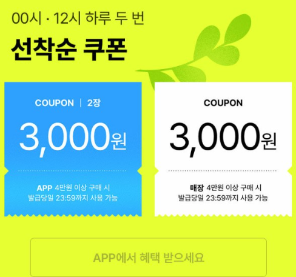
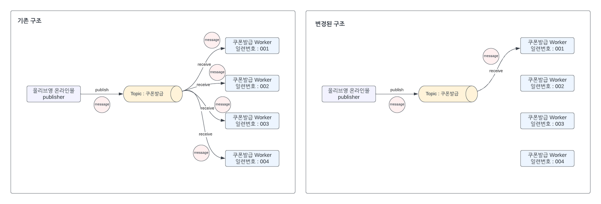
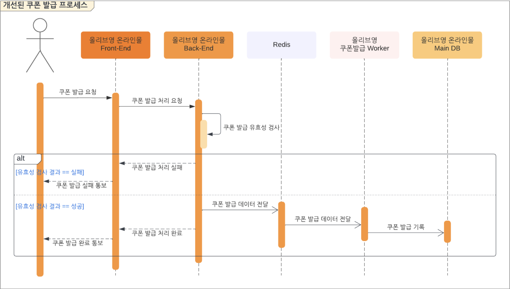
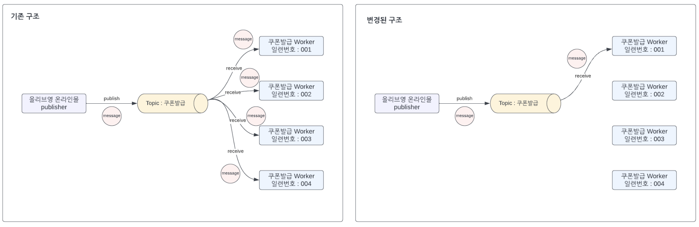
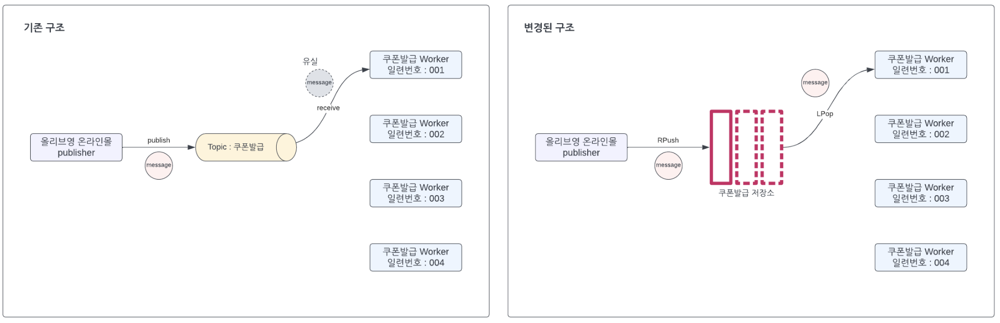
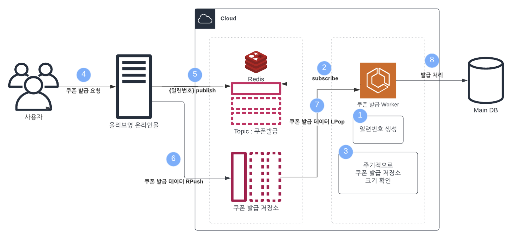

# ❓ 도입 배경 및 필요성

### 현재 상황

* 올리브영은 연 4회 선착순 쿠폰 발급 이벤트를 진행하며, 0시·12시에 트래픽이 급격하게 증가함
* 기존 쿠폰 발급 프로세스는 아래와 같았음

* 쿠폰 발급 요청 이후 모든 단계가 하나의 동기(Sync) 방식으로 처리됨
  (유효성 검사 → DB 기록 → 처리 완료 전송)

### 현재 구조의 장점 & 문제점

**장점**

* 로직 전체가 일체형(동기)으로 구성되어 높은 트래픽에도 순차적으로 안정적으로 처리됨
* **DB 일관성과 신뢰성** 보장

**단점**

* 모든 요청이 큐처럼 순차 처리되기 때문에, 뒤에 있는 사용자는 **Response Time 악화**
* 사용자 경험 측면에서 불리함

### 목표하는 개선 방향

* 사용자 경험 개선을 위해 **Response Time 단축** 필요
* 기존 일체형 구조를 분리하여 비동기 방식으로 개선할 필요 있음

---

# 🔍 아키텍처 분석

* 핵심 개선은 **DB 처리 과정을 분리하는 것**
* 쿠폰 발급 요청 데이터를 **Redis**를 통해 전달

  * 백엔드: Redis에 데이터 Push + 프론트에 처리 완료 응답
  * Worker: Redis에서 데이터 수신 후 DB 처리

### Redis Pub/Sub 특성

* 공급자(Publisher)와 소비자(Subscriber) 구조
* 같은 Topic을 구독 중인 모든 Worker가 메시지를 수신
* In-Memory 기반으로 매우 빠름
* **수신 보장(ACK)이 없어 100% 메시지 전달 신뢰성은 떨어짐**

### 실제 적용 구조

* 사용자가 쿠폰 요청 → 백엔드가 Redis에 Push
* Redis가 Worker에게 전달 → Worker가 DB INSERT 처리

---

# [추가] 트러블슈팅

## 1️⃣ 첫 번째 문제: 다중 Worker에 의한 중복 처리

* 동일 Topic(쿠폰 발급)을 여러 Worker가 구독하면
  → 하나의 메시지를 모든 Worker가 처리하여 **중복 발급 발생**
* **해결:** Worker 중 하나만 선택해 메시지 전달하도록 변경

## 2️⃣ 두 번째 문제: Pub/Sub 메시지 유실

* Pub/Sub는 ACK가 없어 메시지 유실 가능
* 단일 Worker에게 publish해도 전달 실패 가능

**해결 방법**

* Worker에게 고유한 일련번호 부여
* 쿠폰 발급 데이터를 Redis List에 RPush
  (Worker별 쿠폰 저장소 생성)
* Worker는 자신의 저장소를 모니터링하여 데이터가 있으면 LPop 후 DB 기록

---

# 🎟️ 대략적인 쿠폰 발급 로직 추론

| 계층            | 예측 구성                                                  | 근거 / 소스                                                    |
| ------------- | ------------------------------------------------------ | ---------------------------------------------------------- |
| **프론트엔드**     | SPA 기반 프론트(React, Next.js, Vue 등)                      | 글로벌 채용 공고에서 JS/TS/React/Next 언급. 인터뷰에서 Vue/React 사용 사례 언급. |
| **백엔드**       | Spring Boot + Java/Kotlin 기반 MSA Kafka 기반 이벤트 처리 가능 | 공고 및 인터뷰에서 “Spring Boot + Kotlin + Kafka + Redis” 언급.      |
| **캐시 / 인메모리** | Redis 캐시, Pub/Sub, Redisson 분산락                        | 테크블로그에서 Redis 사용 사례 공개.                                    |
| **DB**        | MySQL 기반 RDB, 일부 MongoDB, Kafka 스트림 구성                 | 백엔드 공고에서 “MySQL, MongoDB, Redis, Kafka” 명시.                |
| **인프라**       | Docker + Kubernetes(EKS), AWS                          | Architect 공고에 “Docker/k8s 기반 설계, AWS” 기재.                  |

---

# 📙 자료 수정 방향

* 이미지 자료는 Figma를 통해 향후 개선 예정
* Redis Pub/Sub 관련 심화 내용은 추가 조사 예정
* 올리브영 전체 아키텍처 확인 자료 보강 예정

[출처] [https://oliveyoung.tech/2023-08-07/async-process-of-coupon-issuance-using-redis/](https://oliveyoung.tech/2023-08-07/async-process-of-coupon-issuance-using-redis/)

---

# 활용 및 성과

## Redis Pub/Sub & List 기반 쿠폰 발급 시스템

* 기존 구조에서는 유효성 검사부터 DB 기록까지 온라인몰 백엔드가 모두 처리
* 고트래픽 상황에서 대기시간을 줄이기 위해 **Worker**를 분리
* Redis Pub/Sub & List를 사용해 백엔드 ↔ Worker 간 데이터 전달

## Redis Pub/Sub 적용

1. 사용자가 쿠폰 발급 요청
2. 백엔드가 쿠폰발급 Topic에 메시지 Publish
3. Worker는 메시지를 수신해 DB INSERT

### 문제 1: 다중 Worker 중복 처리

**해결:** 백엔드가 1개의 Worker만 선택해 메시지 전달

### 문제 2: Pub/Sub 메시지 유실

**해결:** Redis List에 모든 메시지를 저장 → Worker가 LPop으로 안정적으로 소비

---

# Redis Pub/Sub + List 최종 구조

**기본 동작**

1. Worker 실행 시 Topic 일련번호 부여
2. 모든 Worker가 Topic을 구독
3. Worker는 주기적으로 List(쿠폰 발급 저장소) 크기 확인 → LPop 후 발급 처리

**쿠폰 발급 시 동작**

1. 사용자가 발급 요청
2. 백엔드가 임의의 Worker 일련번호로 publish
3. Worker별 List에 데이터를 RPush
4. List 크기 > 0인 Worker는 LPop
5. DB INSERT 후 발급 완료

**개선 효과**

* 3월 대비 6월 이벤트에서 분당 발급량 **2.2배 증가**
* 모든 쿠폰이 1~2분 내 소진될 정도로 사용자 경험 크게 개선

---

# 유사 사례 비교 (Kafka / Redis / RabbitMQ)

올리브영이 Redis를 사용한 핵심 이유:
**Burst Traffic(순간 폭증 트래픽) 처리 + 초저지연 성능** 확보

## Apache Kafka와 비교

| 항목         | Redis (In-Memory) | Kafka (Disk-Based) | 해석                       |
| ---------- | ----------------- | ------------------ | ------------------------ |
| Latency    | < 1ms             | 2~10ms             | 쿠폰 발급은 즉시성 중요 → Redis 유리 |
| Throughput | 10만~50만/s         | 수백만/s              | Kafka가 크지만 Redis도 충분     |
| 운영 복잡도     | 낮음                | 매우 높음              | Kafka는 오버엔지니어링           |
| 메시지 보존     | 휘발성               | 영구 저장              | 쿠폰 이벤트는 영구 보관 불필요        |

### 실제 유사 사례: LINE

* Redis로 실시간 메시징
* Kafka로 로그·영구 스트리밍
  → 목적에 맞게 혼용

## 왜 Kafka가 아닌 Redis인가?

1. 초저지연 필요
2. Redis를 이미 사용 중 → 도입 비용 낮음
3. Redis List 등이 로직 구현에 더 직관적

(출처) [https://techblog.lycorp.co.jp/ko/building-a-messaging-queuing-system-with-redis-streams](https://techblog.lycorp.co.jp/ko/building-a-messaging-queuing-system-with-redis-streams)

---

# Redis → RabbitMQ로의 확장

Redis 단독 사용의 한계

* Pub/Sub 특성상 **메시지 유실 위험**
* 유실 방지 로직을 매번 직접 구현해야 함

→ 안정성 강화를 위해 RabbitMQ 도입
→ “확장 후 축소가 어려운 Kafka보다 운영 유연성이 높은 RabbitMQ 선택”

### Redis + RabbitMQ 혼합 모델

* **Redis:** 초고속 선착순 검증 (Lua Script + In-Memory)
* **RabbitMQ:** 메시지 보존, 재시도, ACK 보장

| 역할    | Redis            | RabbitMQ       |
| ----- | ---------------- | -------------- |
| 핵심 기능 | 트래픽 컷오프 / 선착순 판단 | 안정적 DB 처리      |
| 장점    | 초저지연             | 메시지 전달 보장(ACK) |

### 최종 흐름

1. Redis가 선착순 판단 후 합격 요청만 RabbitMQ로 전달
2. RabbitMQ가 안정적으로 Worker에게 메시지 전달
3. Worker가 DB에 반영
